<div align="center">

# 🐱 Catz

**A modern Android app for browsing and favoriting cat breeds**

*Built as a coding challenge for SWORD Health*

[![Code Quality][badge-quality]][ci-quality]
[![Unit Tests][badge-tests]][ci-tests]


[badge-quality]: https://github.com/pedromfmachado/SwordChallenge/actions/workflows/code-quality.yml/badge.svg
[badge-tests]: https://github.com/pedromfmachado/SwordChallenge/actions/workflows/unit-tests.yml/badge.svg
[ci-quality]: https://github.com/pedromfmachado/SwordChallenge/actions/workflows/code-quality.yml
[ci-tests]: https://github.com/pedromfmachado/SwordChallenge/actions/workflows/unit-tests.yml

<br/>

<!-- Replace with your demo GIF -->


</div>

---

## 📋 Table of Contents

- [Quick Start](#-quick-start)
- [Highlights](#-highlights)
- [Features](#-features)
- [Architecture](#-architecture)
- [Build Performance](#-build-performance)
- [Testing](#-testing)
- [Decision Log](#-decision-log)
- [Development Strategy](#-development-strategy)
- [Improvements & Learnings](#-improvements--learnings)
- [Easter Egg](#-easter-egg-i-made-an-ai-grade-its-own-homework)

---

## 🚀 Quick Start

```bash
# 1. Add your API key (get one free at thecatapi.com)
echo "CAT_API_KEY=your_api_key_here" >> local.properties

# 2. Build and install
./gradlew installDebug

# 3. Run tests
./gradlew testDebugUnitTest
```

<details>
<summary>📖 Detailed setup instructions</summary>

### API Key Setup

This app uses [The Cat API](https://thecatapi.com/) to fetch breed data.

1. Get a free API key from [thecatapi.com/signup](https://thecatapi.com/signup)
2. Add the key to `local.properties` in the project root:
   ```properties
   CAT_API_KEY=your_api_key_here
   ```
3. Build and run the app

> **Note:** `local.properties` is gitignored and should not be committed.

### All Commands

```bash
# Build
./gradlew assembleDebug

# Run tests
./gradlew testDebugUnitTest              # Unit tests
./gradlew validateDebugScreenshotTest    # Screenshot tests
./gradlew :app:connectedDebugAndroidTest # E2E tests (requires device)

# Code quality
./gradlew ktlintCheck                    # Check style
./gradlew ktlintFormat                   # Fix style issues
./gradlew lint                           # Android lint
```

</details>

---

## ✨ Highlights

|  |  |
|:---:|---|
| 🏗️ | **Multi-module Clean Architecture** — 4 modules with pure Kotlin domain layer |
| 🧪 | **4 Layers of Testing** — Unit, UI, Screenshot, and E2E tests |
| 📴 | **Offline-First** — Network-first strategy with graceful cache fallback |
| ⚡ | **Reactive Updates** — Room Flows for real-time sync across screens |
| 🔄 | **Infinite Scroll** — Paginated list with seamless loading |
| 🤖 | **AI-Assisted Development** — Built with Claude Code ([see Easter Egg](#-easter-egg-i-made-an-ai-grade-its-own-homework)) |

---

## 📱 Features

| Feature | Description |
|---------|-------------|
| **Browse Breeds** | Paginated list with images, names, and origin |
| **Search** | Instant filtering with debounced input |
| **Breed Details** | Origin, temperament, lifespan, and description |
| **Favorites** | Toggle from any screen, persisted locally |
| **Average Lifespan** | Calculated across all favorited breeds |
| **Offline Support** | Full functionality with cached data |

### Tech Stack

| Category | Technology |
|----------|------------|
| Language | Kotlin 2.0, Java 21 |
| UI | Jetpack Compose, Material 3 |
| Architecture | Multi-module Clean Architecture, MVVM |
| DI | Hilt |
| Networking | Retrofit, Moshi |
| Database | Room |
| Image Loading | Coil |
| Navigation | Navigation Compose |
| Testing | JUnit, Mockito, Robolectric, MockWebServer |
| CI | GitHub Actions |

---

## 🏗️ Architecture

Multi-module Clean Architecture with clear separation of concerns:

```mermaid
graph TD
    subgraph "Presentation"
        APP[🎯 app<br/><i>Navigation, DI, Entry point</i>]
    end

    subgraph "Feature"
        FEAT[📱 cat_breeds<br/><i>ViewModels, UI, UseCases</i>]
    end

    subgraph "Data"
        DATA[💾 cat_breeds_data<br/><i>Room, Retrofit, Mappers</i>]
    end

    subgraph "Domain"
        API[📦 cat_breeds_api<br/><i>Pure Kotlin contracts</i>]
    end

    APP --> FEAT
    APP --> DATA
    FEAT --> API
    DATA --> API

    style API fill:#e8f5e9,stroke:#2e7d32
    style APP fill:#fff3e0,stroke:#ef6c00
    style FEAT fill:#e3f2fd,stroke:#1565c0
    style DATA fill:#fce4ec,stroke:#c2185b
```



<details>
<summary><b>Why Pure Kotlin for Domain?</b></summary>

The `cat_breeds_api` module has **zero Android dependencies**:
- ⚡ Fastest possible compilation (no Android plugin overhead)
- 🔄 Domain models usable from any JVM context
- 🛡️ Clear architectural boundary enforcement

</details>

<details>
<summary><b>Offline Strategy</b></summary>

| Screen | Strategy | Rationale |
|--------|----------|-----------|
| List | Network-first, cache fallback | Fresh data when online, graceful degradation offline |
| Detail | Cache-only | API detail endpoint doesn't return images |
| Favorites | Local-only | Stored in separate Room table |

</details>

<details>
<summary><b>Reactive Favorites</b></summary>

Favorites use a **separate table** rather than a column on breeds:
- ✅ Preserves favorites when cache is refreshed
- ✅ Enables reactive updates via Room Flows
- ✅ Keeps API data separate from user preferences

Both List and Favorites screens observe Room Flows — changes sync automatically.

</details>

---

## ⚡ Build Performance

The multi-module architecture delivers measurable build performance benefits through **parallel compilation** and **compilation avoidance**.

### Parallel Compilation

Gradle compiles independent modules simultaneously across available CPU cores. With our 4-module structure, `cat_breeds` and `cat_breeds_data` compile in parallel since they only share `cat_breeds_api` as a common dependency.

| Build Type | Time | Speedup |
|------------|------|---------|
| Sequential | ~67s | — |
| Parallel | ~8s | **~8x faster** |

<details>
<summary><b>Build scan comparison</b></summary>

- [Sequential build scan](https://gradle.com/s/lw5qwonj2dcgk) — Tasks execute one after another
- [Parallel build scan](https://gradle.com/s/trx77sbcypurk) — Multiple workers process independent tasks

<!-- TODO: Add screenshot showing timeline comparison -->
<!--  -->

</details>

### Compilation Avoidance

Kotlin's compilation avoidance skips recompilation when a module's ABI (Application Binary Interface) hasn't changed. More importantly, changes in one module only trigger recompilation of **dependent modules**, not siblings.

```
cat_breeds_api ← cat_breeds_data ← app
      ↑                            ↑
      └──── cat_breeds ────────────┘
```

| Change Location | Modules Recompiled | Tasks Executed |
|-----------------|-------------------|----------------|
| `cat_breeds_api` | api → data → breeds → app | 22 |
| `cat_breeds_data` | data → app (not breeds!) | 17 |
| None (incremental) | None | 0 |

<details>
<summary><b>Build scan examples</b></summary>

- [API module change](https://gradle.com/s/qtxtz3tmletny) — Cascades to all dependents
- [Data module change](https://gradle.com/s/6xtdf55ene5cm) — Only affects data + app
- [Incremental build](https://gradle.com/s/44fk72uesnuws) — Everything UP-TO-DATE

<!-- TODO: Add screenshots showing task execution differences -->
<!--  -->
<!--  -->

</details>

<details>
<summary><b>Gradle configuration</b></summary>

These optimizations are enabled in `gradle.properties`:

```properties
# Parallel module compilation
org.gradle.parallel=true

# Build cache for incremental builds
org.gradle.caching=true
```

The [Develocity plugin](https://gradle.com/develocity/) is configured in `settings.gradle.kts` for build scan publishing.

</details>

---

## 🧪 Testing

<table>
<tr>
<td width="25%" align="center"><b>Unit</b><br/>ViewModels, Repository,<br/>UseCases, Mappers</td>
<td width="25%" align="center"><b>UI</b><br/>Robolectric +<br/>Compose Test</td>
<td width="25%" align="center"><b>Screenshot</b><br/>Visual regression<br/>& component catalog</td>
<td width="25%" align="center"><b>E2E</b><br/>MockWebServer +<br/>Hilt + Room</td>
</tr>
</table>

<details>
<summary><b>Why Robolectric for Compose Tests?</b></summary>

Compose UI tests traditionally require an emulator, making them slow and flaky. With Robolectric:
- ⚡ Tests run on JVM with near-instant execution
- ✅ Still exercises real Compose rendering logic
- 🔄 CI-friendly without emulator overhead

</details>

<details>
<summary><b>Screenshot Tests as Component Library</b></summary>

Beyond regression testing, screenshots serve as a **visual catalog**:
- Each component has reference images documenting expected appearance
- States covered: loading, error, empty, populated
- Acts as living documentation for the design system

</details>

<details>
<summary><b>Test Object Providers</b></summary>

Reusable fixtures reduce boilerplate and ensure consistent defaults:

```kotlin
aBreed(id = "abc", name = "Persian", isFavorite = true)  // Domain
aBreedDto(lifeSpan = "12 - 15")                          // API
aBreedEntity(origin = "Egypt")                            // Database
```

</details>

---

## 📝 Decision Log

<details>
<summary><b>View all technical decisions</b></summary>

| Decision | Rationale |
|----------|-----------|
| **Robolectric for Compose tests** | Fast, reliable UI tests on JVM. CI-friendly without emulator overhead. |
| **Screenshot testing** | Visual component documentation + catches unintended UI changes. Living style guide. |
| **Local-only favorites** | Cat API only supports favoriting images (not breeds). Local storage was pragmatic. |
| **Cache-only detail screen** | `/breeds/:breed_id` doesn't return images. Cached list data ensures images available. |
| **ViewModels → Repository directly** | Most operations lack business logic. UseCases for pass-through adds noise. `ToggleFavoriteUseCase` exists because it has real logic. |
| **No TDD** | Prioritized velocity for challenge. Tests added post-implementation to validate behavior. |

</details>

---

## 🛠️ Development Strategy

This project was developed using **[Claude Code](https://claude.ai/download)** as an AI pair-programming assistant:

- **Git worktrees** — Isolated feature development without stashing
- **Iterative development** — Features implemented incrementally with continuous refinement
- **Tests post-implementation** — Not TDD; tests added after features working

The AI assisted with boilerplate generation, architecture decisions, and edge case identification. I maintained control over design choices and code review.

---

## 🔮 Improvements & Learnings

<details>
<summary><b>What I'd improve</b></summary>

| Improvement | Why |
|-------------|-----|
| **Roborazzi over Screenshot Testing** | Compose Preview Screenshot Testing is experimental and awkward in CI. Roborazzi + Robolectric is more mature. |
| **Paging 3 with RemoteMediator** | Would handle network/database coordination automatically. Better separation of concerns. |
| **Claude Code + GitHub Actions** | Auto-implement PR feedback via AI integration. |
| **TDD from the start** | Tests-first catches design issues earlier and ensures testability. |

</details>

<details>
<summary><b>What I learned</b></summary>

| Learning | Context |
|----------|---------|
| **Stale cache risk** | Detail view has no refresh mechanism. If API data changed since list fetch, detail shows outdated info. |
| **Configure linting early** | Adding ktlint late meant fixing hundreds of issues at once. Day-one setup with pre-commit hooks is smoother. |

</details>

---

## 🥚 Easter Egg: Challenge Evaluator Skill

This project was built with [Claude Code](https://claude.ai/download). To demonstrate custom skill creation, I built an evaluator that assesses coding challenge submissions against structured criteria.

Then I ran it on this repo. It rated the submission as **"Senior Developer with 90% confidence."**

*(I swear I didn't tweak the rubric.)*

**📄 [See the full evaluation report](./EVALUATION_SAMPLE.md)** — includes interview questions that I'm now fully expecting to be asked.

<details>
<summary><b>What this demonstrates</b></summary>

- **Custom Claude Code skills** — Structured workflows with multi-phase evaluation
- **Prompt engineering** — Defining rubrics, output formats, and evaluation criteria
- **Practical AI tooling** — Building useful automation beyond just code generation

The skill lives in `.claude/skills/catz-challenge-evaluator/`. Run it yourself if you have Claude Code:

```
evaluate this challenge
```

</details>

---

<div align="center">

**Built with 🐱 and [Claude Code](https://claude.ai/download)**

</div>
